# SnapFood API in DRF

**Developer: Aleksandra Haniok**

💻 [Live link](http://snapfood-drf-api.herokuapp.com/)

This repository contains the API set up using Django REST Framework for the SnapFood front-end application ([repository here](https://github.com/aleksandracodes/CI_PP5_Snapfood) and [live website here](https://ci-pp5-snapfood.herokuapp.com/))

## Table of Contents
  - [User Stories](#user-stories)
  - [Database](#database)
  - [Technologies Used](#technologies-used)
  - [Validation](#validation)
  - [Testing](#testing)
  - [Deployment](#deployment)
  - [Credits](#credits)

## User Stories

The back-end section of the project focuses on its administration side and covers one user story:
- As an admin, I want to be able to create, edit and delete the users, posts, comments and likes, so that I can have a control over the content of the application and remove any potential inappropriate content


## Database

The following models were created to represent the database model structure of the application:


#### User Model

- The User model contains information about the user. It is part of the Django allauth library.
- One-to-one relation with the Profile model owner field
- ForeignKey relation with the Follower model owner and followed fields
- ForeignKey relation with the Post model owner field
- ForeignKey relation with the Comment model owner field
- ForeignKey relation with the Like model owner field

#### Profile Model

- The Profile model contains the following fields: owner, name, description, created_on, updated_on and image
- One-to-one relation between the owner field and the User model id field

#### Post Model

- The Post model contains the following fields: owner, created_on, updated_on, title, description, category and image
- ForeignKey relation with the Comment model post field
- ForeignKey relation with the Like model post field

#### Follower Model

- The Follower model contains the following fields: owner, followed and created_on
- ForeignKey relation between the owner field and the User model id field
- ForeignKey relation between the followed field and the User model post field

#### Comment Model

- The Comment model contains the following fields: owner, post, created_on, updated_on and comment_content
- ForeignKey relation between the owner field and the User model id field
- ForeignKey relation between the post field and the User model post field

#### Like Model

- The Like model contains the following fields: owner, post and created_on
- ForeignKey relation between to the User model id field
- ForeignKey relation between the owner field and the User model id field
- ForeignKey relation between the post field and the Post model post field

##### Back to [top](#table-of-contents)


## Technologies Used

### Languages & Frameworks

- Python
- Django

### Libraries & Tools

- [Cloudinary](https://cloudinary.com/) to store static files and serve them to Heroku
- [Dbdiagram.io](https://dbdiagram.io/home) used for the database schema diagram
- [Git](https://git-scm.com/) was used for version control via Gitpod terminal to push the code to GitHub
- [GitHub](https://github.com/) was used as a remote repository to store project code
- [Gitpod)](https://gitpod.io/workspaces) - a virtual IDE workspace used to build this site
- [Heroku Platform](https://id.heroku.com/login) was used to deploy the project into live environment
- [Django REST Framework](https://www.django-rest-framework.org/) was used to build the back-end API
- [Django AllAuth](https://django-allauth.readthedocs.io/en/latest/index.html) was used for user authentication
- [Gunicorn](https://gunicorn.org/) was used for deploying the project to Heroku
- [Pillow](https://pillow.readthedocs.io/en/stable/) was used for image processing and validation
- [Psycopg2](https://www.psycopg.org/docs/) was used as a PostgreSQL database adapter for Python
- [PostgreSQL](https://www.postgresql.org/) – deployed project on Heroku uses a PostgreSQL database

##### Back to [top](#table-of-contents)


## Validation

### PEP8 Validation
[PEP8](http://pep8online.com/) Validation Service was used to check the code for PEP8 requirements. All the code passes with no errors or warnings.


## Testing

### Manual testing of user stories

- As an admin, I want to be able to create, edit and delete the users, posts, comments and likes, so that I can have a control over the content of the application and remove any potential inappropriate content

**Test** | **Action** | **Expected Result** | **Actual Result**
-------- | ------------------- | ------------------- | -----------------
User | Create, update & delete user | A user can be created, edited or deleted | Works as expected
User | Change permissions | User permissions can be updated | Works as expected
Profile | Create, update & delete | User profile can be created, edited or deleted | Works as expected
Post | Create, update & delete | A post can be created, edited or deleted | Works as expected
Comment | Create, update & delete | A comment can be created, edited or deleted | Works as expected
Like | Create & delete | A like can be created or deleted (like / unlike post) | Works as expected
Follower | Create & delete | Follow or unfollow user | Works as expected

In addition, posts, comments, likes and following can be created by logged-in users only. Users can only update or delete the content which was created by themselves.

<details><summary>Screenshots - USER</summary>
    <details><summary>Create user</summary>
    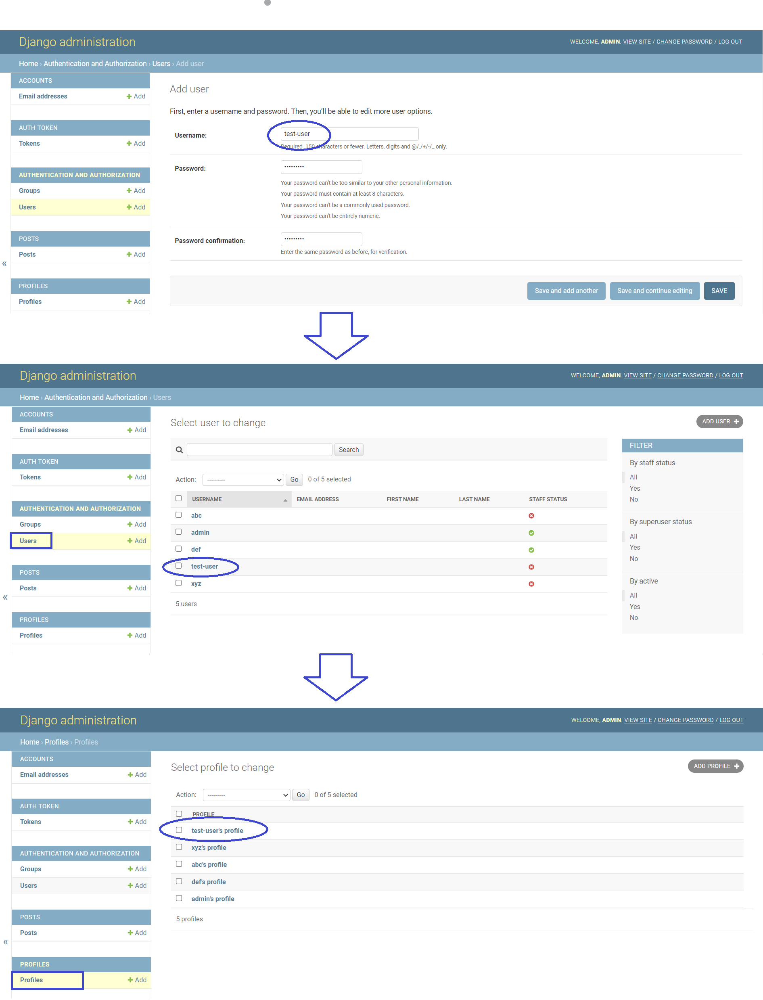
    </details>
    <details><summary>Change user permissions</summary>
    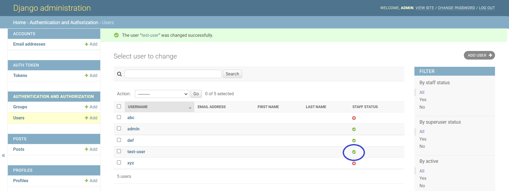
    </details>
</details>

<details><summary>Screenshots - PROFILE</summary>
    <details><summary>Update profile</summary>
    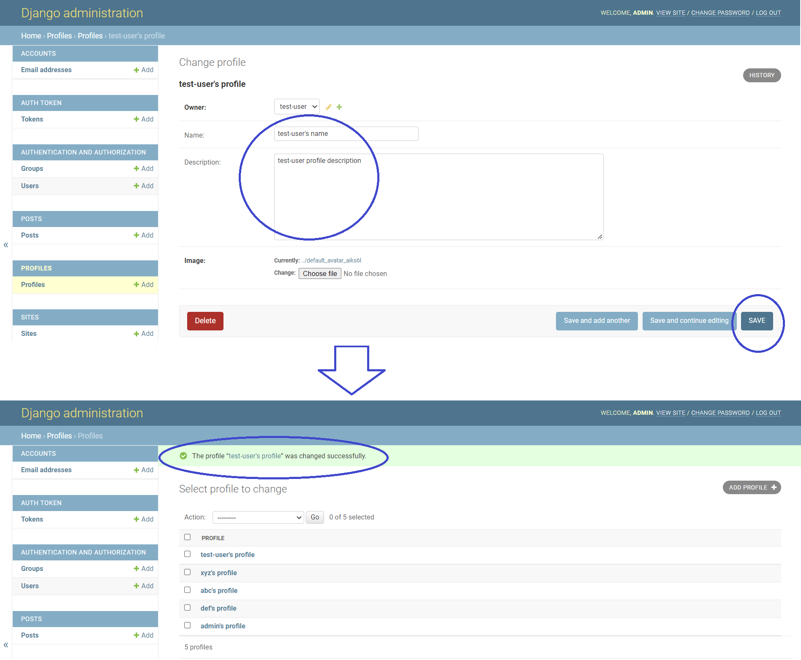
    </details>
        <details><summary>Delete profile</summary>
    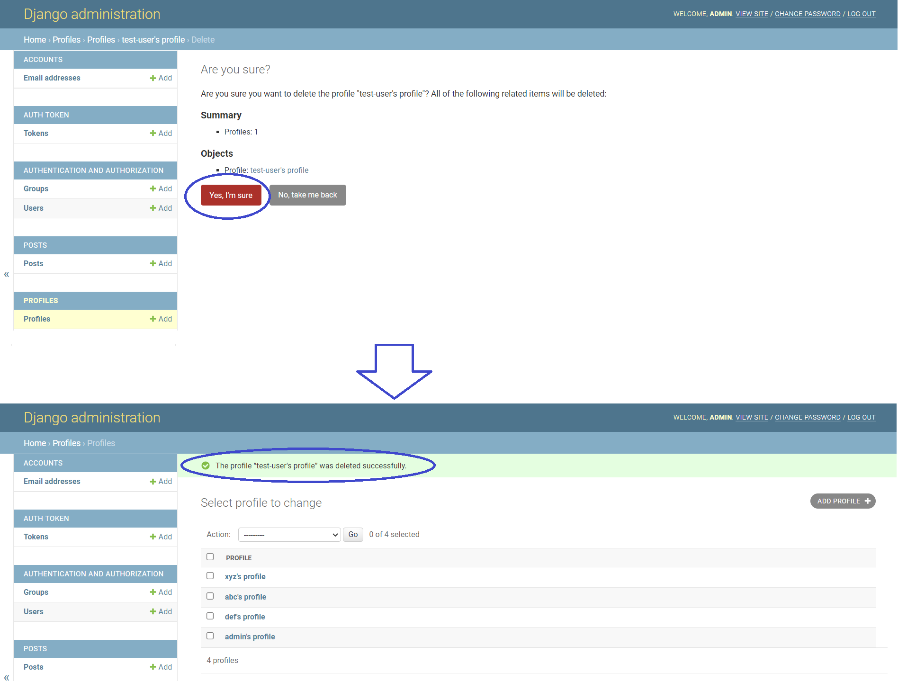
    </details>
</details>

<details><summary>Screenshots - POST</summary>
    <details><summary>Create post</summary>
    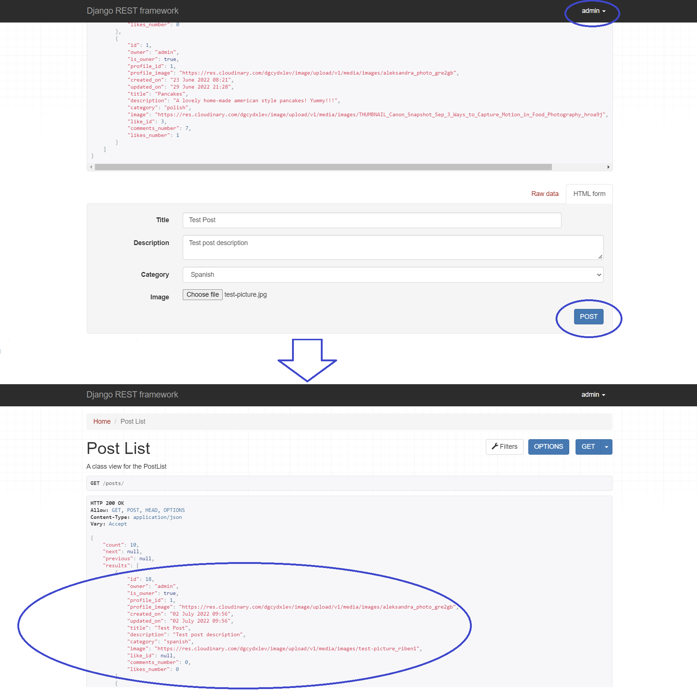
    </details>
    <details><summary>Update post</summary>
    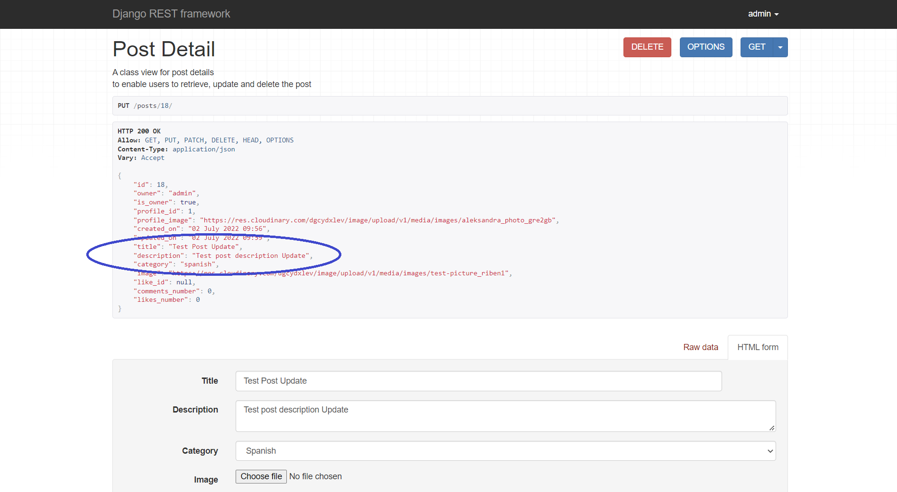
    </details>
    <details><summary>Delete post</summary>
    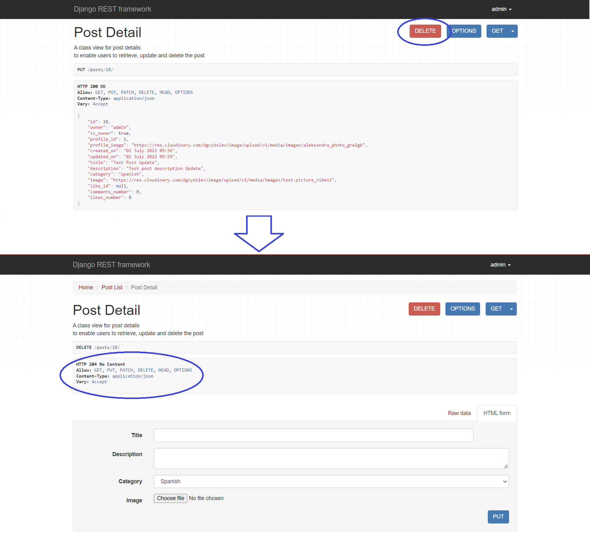
    </details>
</details>

<details><summary>Screenshots - COMMENT</summary>
    <details><summary>Create comment</summary>
    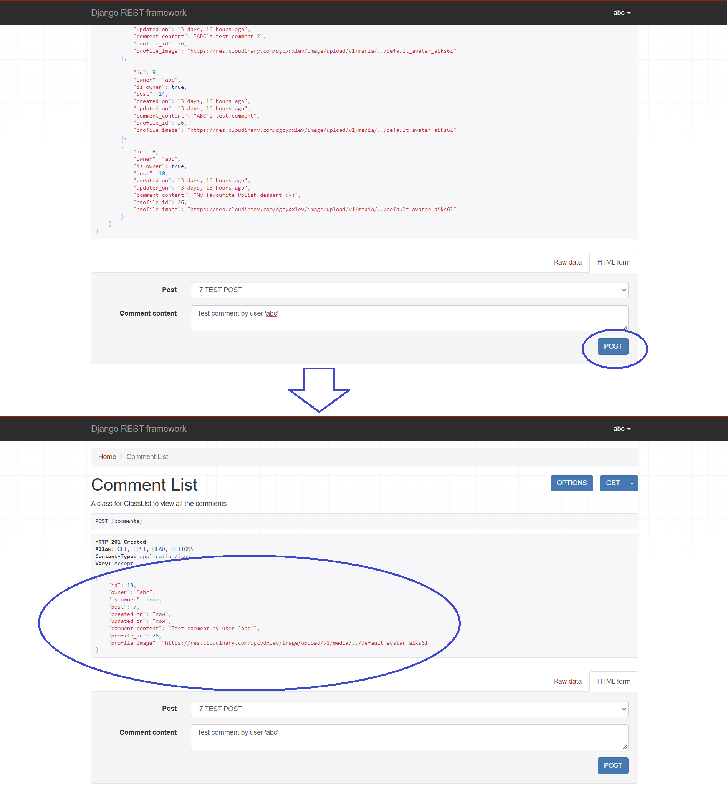
    </details>
    <details><summary>Update comment</summary>
    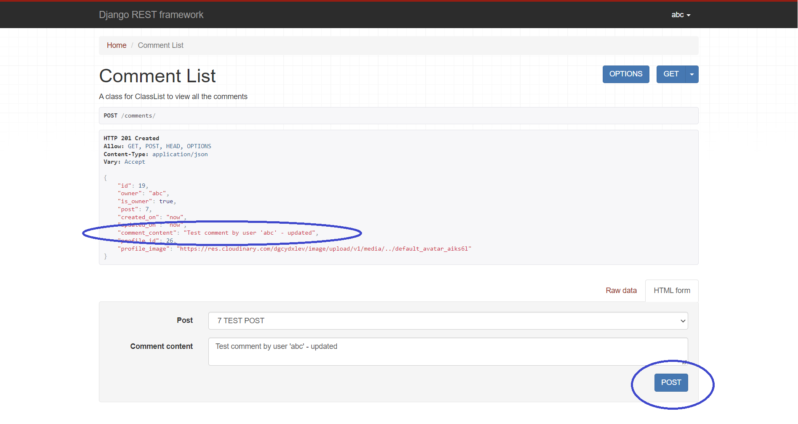
    </details>
    <details><summary>Delete comment</summary>
    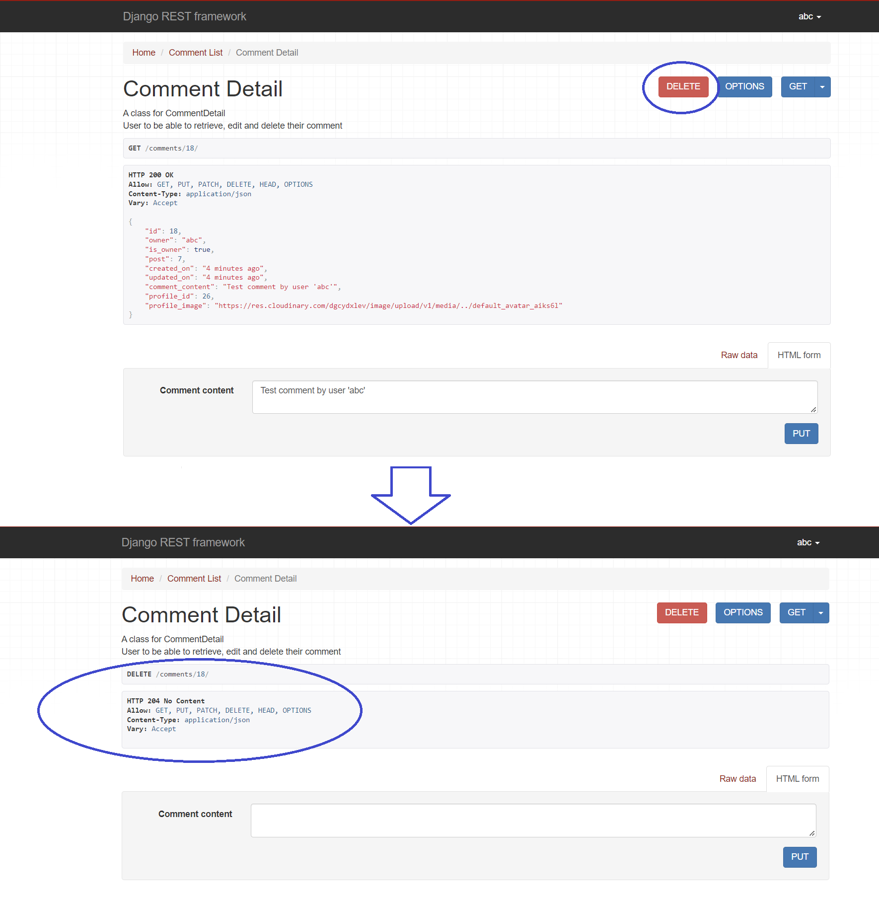
    </details>
</details>

<details><summary>Screenshots - LIKE</summary>
    <details><summary>Create like - like post</summary>
    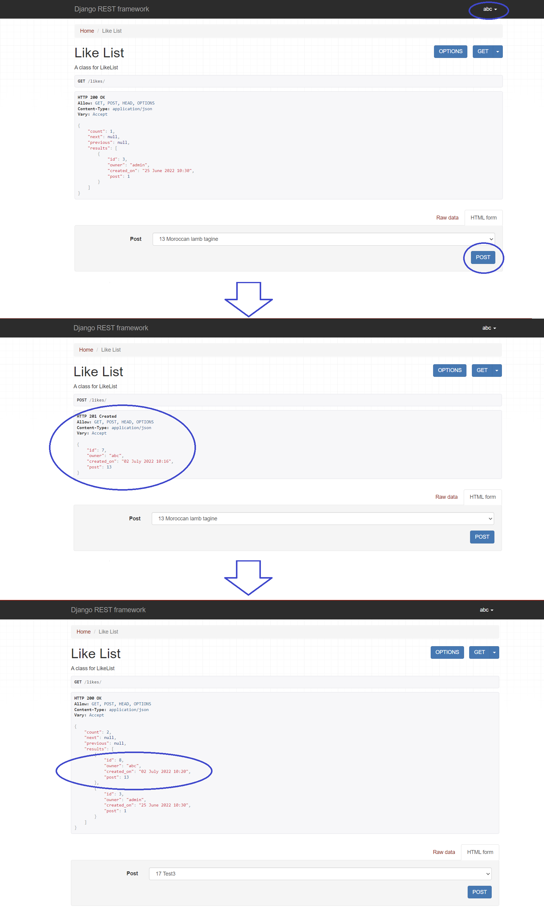
    </details>
    <details><summary>Delete like - unlike post</summary>
    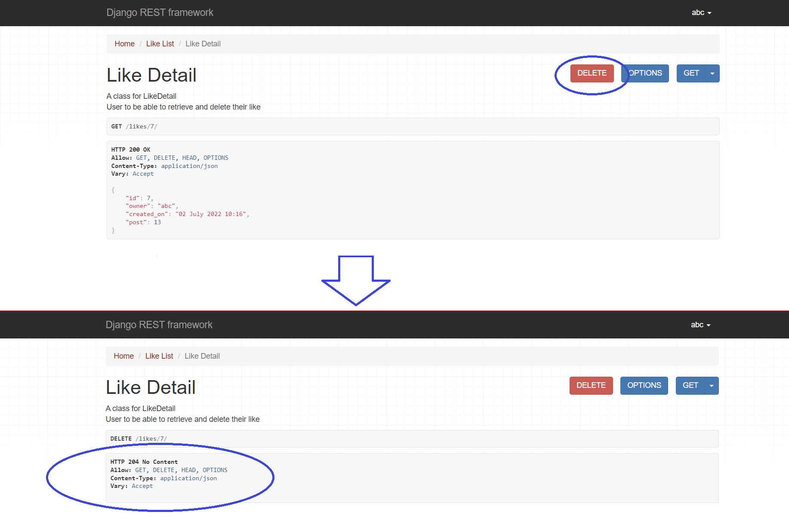
    </details>
</details>

<details><summary>Screenshots - FOLLOWER</summary>
    <details><summary>Create - Follow user</summary>
    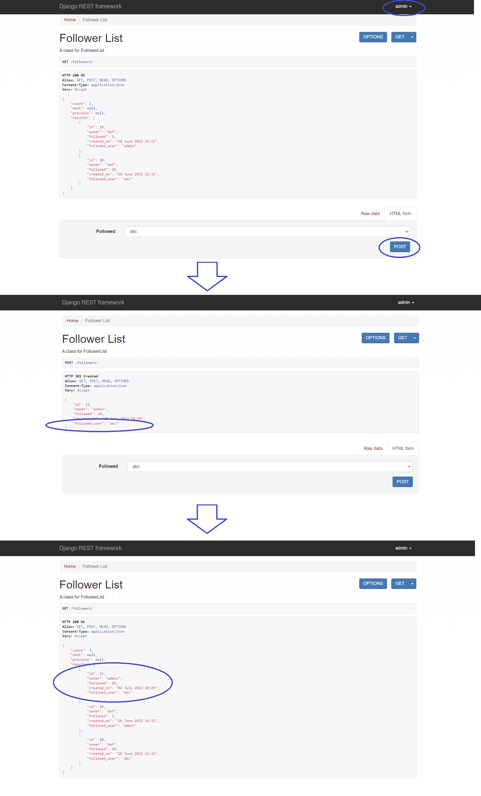
    </details>
    <details><summary>Delete - Unfollow user</summary>
    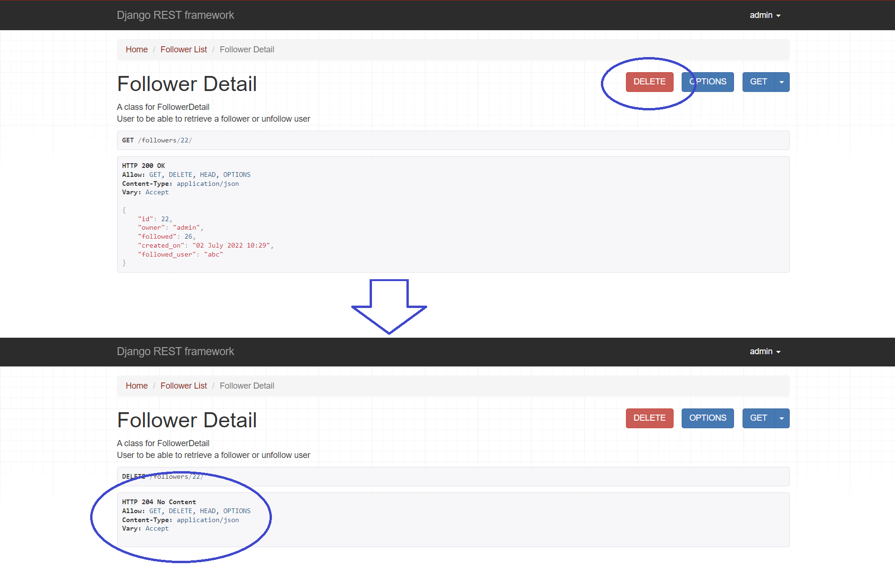
    </details>
</details>

##### Back to [top](#table-of-contents)


## Deployment

### Heroku Deployment
This application has been deployed from GitHub to Heroku by following the steps:

1. Create or log in to your account at heroku.com
2. Create a new app, add a unique app name (this project is named "snapfood-drf-api") and choose your region
3. Click on create app
4. Under resources tab search for Postgres in Add-ons section, and add a Postgres database to the app. PostgreSQL DATABASE_URL will be added to the app Config Vars.
5. Install the libraries dj-database-url and psycopg2 (pip install dj_database_url psycopg2)
6. In settings.py file import dj_database_url
7. In settings.py add if statement to the databases variable. This is to keep the development and production environments and their databases separate.
    ```
    DATABASES = {
        'default': ({
            'ENGINE': 'django.db.backends.sqlite3',
            'NAME': BASE_DIR / 'db.sqlite3',
        } if 'DEV' in os.environ else dj_database_url.parse(
            os.environ.get('DATABASE_URL')
        ))
    }
    ```
8. Install and configure django-cors headers and gunicorn libraries

9. Create a Procfile in your app: 
   ```
   release: python manage.py makemigrations && python manage.py migrate
   web: gunicorn PROJECT_NAME.wsgi
   ```
   The first line is to ensure that migrations are created and applied to the Heroku postgres database.
   The second line tells Heroku to serve our app using gunicorn.

10. Set the ALLOWED_HOSTS 
    ```
    ALLOWED_HOSTS = [
      os.environ.get('ALLOWED_HOST'),
      'localhost',
    ]
    ```

11. Install Django cors headers library (pip install django-cors-headers), add it to the installed apps and to a middleware class in the settings.py - 'corsheaders.middleware.CorsMiddleware'.

12. In settings.py, update the CORS_ALLOWED_ORIGIN_REGEXES variable to match your local server url.
    ```
    if 'CLIENT_ORIGIN_DEV' in os.environ:
        extracted_url = re.match(r'^.+-', os.environ.get('CLIENT_ORIGIN_DEV', ''), re.IGNORECASE).group(0)
        CORS_ALLOWED_ORIGIN_REGEXES = [
            rf"{extracted_url}(eu|us)\d+\w\.gitpod\.io$",
        ]
    ```

13. Add JWT_AUTH_SAMESITE = 'None' to be able to have the front end app and the API deploted to different platforms

14. Add remaining environment variables settings to env.py file at the root directory. Make sure to add this file to .gitignore.
    ```
    import os
      os.environ["CLOUDINARY_URL"] = "your cloudinary url"
      os.environ['DEV'] = '1'
      os.environ["SECRET_KEY"] = "your secret_key"
    ```

15. Replace the insecure SECRET_KEY with the environment variable
    ```
    SECRET_KEY = os.enrivon.get('SECRET_KEY')
    ```

16. Change the DEBUG settings DEBUG = 'DEV' in os.environ (it will equal False in production)

17. Go to Settings in your Heroku and set the environment variables in the Config Vars. PostgreSQL DATABASE_URL should already be there.

    ```
    ALLOWED_HOST | your_deployed_api_url  
    CLIENT_ORIGIN | your_deployed_frontend_url
    CLIENT_ORIGIN_DEV | your_local_server_url
    CLOUDINARY_URL | your_API_variable
    DATABASE | created when added Postgres to Heroku Add-ons
    SECRET_KEY | your_secret_key
    DISABLE_COLLECTSTATIC | 1
    ```

18. Update the requirements.txt file to ensure the deployment doesn't fail by writing in the terminal "pip3 freeze --local > requirements.txt"

19. Push your changes to GitHub

20. Push the code to Heroku using the command git push heroku main

- Go to "Deploy" in the menu bar on the top
- Deployment method: Heroku Git (direct connection to GitHub is no longer available)
- Follow steps as shown:
  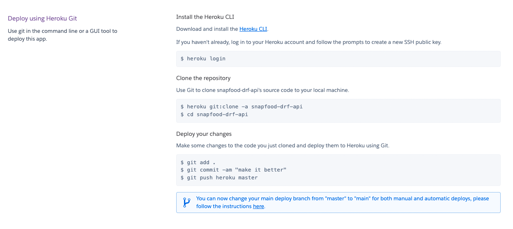

##### Back to [top](#table-of-contents)


## Credits

### Images

- User avatar default image taken from [here](https://community.atlassian.com/t5/Jira-questions/JIRA-Anonymous-users-can-t-see-user-avatars/qaq-p/1060103) and colors changed using Paint
- Default post image found [here](https://www.fiverr.com/logo-maker/brief/logo_name?brief_id=0d212c49-2416-401d-99a5-780b9b233ff7) and tweaked with Paint

### Code

This project was created based on the Code Institute's Django REST API walkthrough project ['Moments'](https://github.com/Code-Institute-Solutions/drf-api) which was a great learning experience.

##### Back to [top](#table-of-contents)